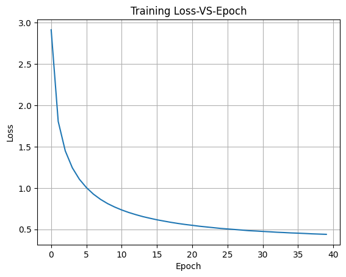

# seq2seq-mt-no-attention

A PyTorch implementation of a **Sequence-to-Sequence (Seq2Seq) Neural Machine Translation** model translating
English to French **without attention**.

This repository demonstrates building a baseline NMT system using a bidirectional GRU encoder and a GRU decoder
trained on the Tatoeba dataset.

---

## Project Overview

- Implements classic encoder-decoder architecture without attention  
- Uses teacher forcing during training  
- Handles variable-length sequences with padding and packing  
- Supports gradient clipping for stable training  
- Provides scripts and notebook for training and inference demonstrations  

---


## Dataset and Preprocessing

- Based on the [Tatoeba English-French dataset](https://www.manythings.org/anki/)  
- Filtered sentence pairs to max length of 10 tokens  
- Vocabulary sizes after preprocessing:  
  - English: 13,868 unique tokens  
  - French: 22,385 unique tokens  

---

##  Project Structure

```bash

seq2seq-mt-no-attention/
    │
    ├── model.py # Encoder and Decoder model definitions
    ├── dataloader_generator.py # Dataset classes and DataLoader setup
    ├── utils.py # Training functions and utility methods
    ├── demo_script.py # Training and inference script
    ├── demo.ipynb # Jupyter notebook walkthrough
    ├── requirements.txt # Python dependencies
    ├── README.md # Project overview and instructions
    ├── fra.txt # Raw French-English dataset file (downloaded)
    └── outputs/ # Folder to save checkpoints, logs, and results (optional)
```
---

## Getting Started

### Requirements

```bash
 Install dependencies with:

    pip install -r requirements.txt
    
```
 ### Running the Demo:
 ```bash
     python demo_script.py
     jupyter notebook demo.ipynb
     
```
---


## Training Results

```bash

| Epoch  | Loss   | Encoder Grad Norm | Decoder Grad Norm | Time (sec) |
|--------|---------|------------------|-------------------|------------|
| 0      | 2.9112  | 0.515            | 0.718             | 56.8       |
| 5      | 1.0046  | 0.620            | 0.648             | 281.4      |
| 10     | 0.7345  | 0.774            | 0.847             | 282.3      |
| 15     | 0.6158  | 0.786            | 0.742             | 282.5      |
| 20     | 0.5491  | 0.624            | 0.588             | 283.3      |
| 25     | 0.5051  | 0.789            | 0.702             | 281.8      |
| 30     | 0.4753  | 0.890            | 0.866             | 282.4      |
| 35     | 0.4542  | 0.824            | 0.756             | 283.0      |

Training converges steadily, with loss decreasing significantly after the first 10 epochs.
```
---

---

## Sample Translations

```bash

| Input Sentence                    | Target Translation                      | Model Prediction                        |
|-----------------------------------|-----------------------------------------|-----------------------------------------|
| tom ought to stop doing that      | tom devrait arreter de faire cela       | tom devrait arreter de faire ca         |
| tom doesn t blame you for anything| tom ne te reproche rien                 | tom ne te reproche rien                 |
| tom thinks i m his enemy          | tom pense que je suis son ennemi        | tom pense que j ai l ennemi             |
| we re fighting for our lives      | nous nous battons pour nos vies         | nous nous battons pour nos vies         |
| i m not willing to take that risk | je ne suis pas pret a prendre ce risque | je ne suis pas pret a prendre ce risque |
| this book contains many pictures  | ce livre a beaucoup d images            | ce livre contient de nombreuses images  |
| i ll go anywhere you want         | j irai ou vous voulez                   | j irai ou tu veux                       |
| we ve run out of gas              | nous n avons plus d essence             | nous n avons plus d essence             |
| please step inside                | entrez je vous prie !                   | entrez je te prie !                     |
| the snow was knee deep            | la neige montait jusqu au genou         | la neige montait jusqu au genou         |

The model produces fluent translations on many examples, with occasional minor word choice differences.
```
---

## Conclusion

This project demonstrates a fundamental Seq2Seq neural machine translation model without attention, built using PyTorch.
Despite its simplicity, the model effectively learns to translate English sentences into French with reasonable accuracy
on a large dataset.

The training results show steady improvement in loss, and the sample translations confirm that the model captures essential
language patterns. However, without attention mechanisms, the model struggles with longer or more complex sentences.

This repo provides a solid baseline for understanding and experimenting with sequence-to-sequence models and sets the stage
for future enhancements like attention, beam search, and evaluation metrics to improve translation quality.

---
