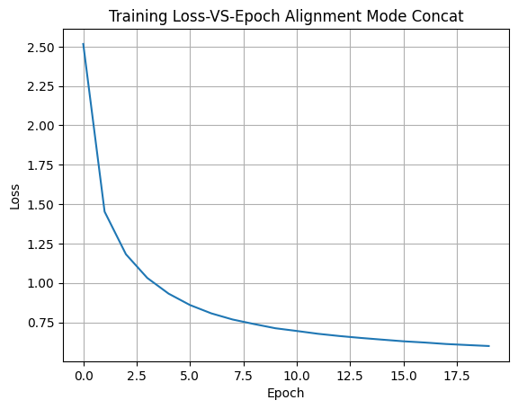
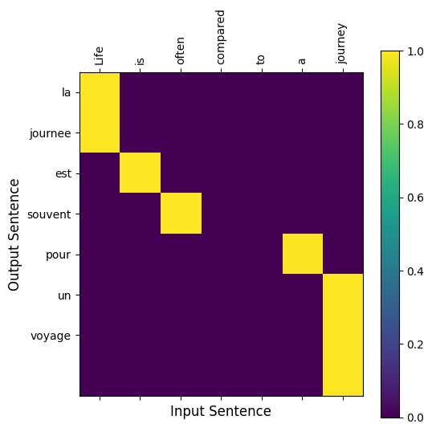
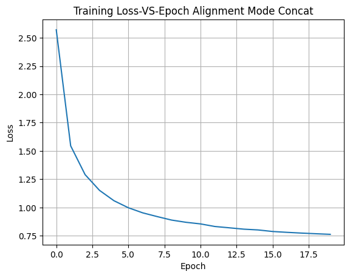
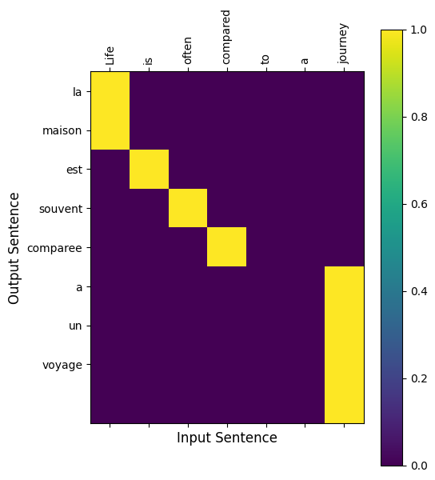
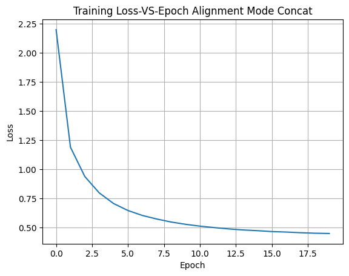
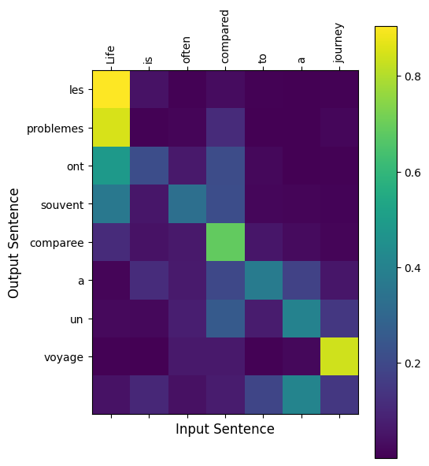

# seq2seq Neural Machine Translation (NMT) with Luong Attention Variants (English → French)

This project implements a sequence-to-sequence (seq2seq) neural machine translation model with **Luong-style attention
mechanisms** to translate English sentences into French.

We explore and compare the following attention variants described by **Luong et al. (2015)**:
- **Dot Product**
- **General**
- **Concat**

---

## Project Overview

- Implements classic encoder-decoder architecture with luong attention  
- Uses teacher forcing during training  
- Handles variable-length sequences with padding and packing  
- Supports gradient clipping for stable training  
- Provides scripts and notebook for training and inference demonstrations  

---

## Dataset and Preprocessing

- Based on the [Tatoeba English-French dataset](https://www.manythings.org/anki/)  
- Filtered sentence pairs to max length of 10 tokens  
- Vocabulary sizes after preprocessing:  
  - English: 13,868 unique tokens  
  - French: 22,385 unique tokens  

---

## Attention Mechanisms

| Mode             | Description                                                                 |
|------------------|-----------------------------------------------------------------------------|
| **Dot Product**  | Simplest Luong attention: dot product between encoder and decoder states    |
| **General**      | Applies a linear layer to encoder states before dot product                 |
| **Concat**       | Concatenates encoder and decoder states, followed by an MLP                 |

---

##  Project Structure

```bash

seq2seq-nmt-luong-attention/
    ├── models.py                       # Encoder, Decoder, and Attention implementations
    ├── dataloader_generator.py         # Data loading and preprocessing
    ├── utils.py                        # Training, translation, visualization utilities
    ├── demo_script.py                  # Script to run training and inference
    ├── demo.ipynb                      # Training analysis notebook with examples
    ├── README.md                       # Project summary and insights
```
---

## Getting Started

### Requirements

```bash
 Install dependencies with:

    pip install -r requirements.txt
    
```
 ### Running the Demo:
 ```bash
     python demo_script.py
     jupyter notebook demo.ipynb
     
```
---


## Training Performance By Attention Types


### Dot Product Attention Training Logs

| Epoch | Loss   | Encoder Grad Norm | Decoder Grad Norm | Time (min) |
| ----- | ------ | ----------------- | ----------------- | ---------- |
| 0     | 2.5169 | 0.966             | 1.110             | 2.74       |
| 5     | 0.8594 | 0.818             | 0.911             | 13.91      |
| 10    | 0.6948 | 0.697             | 0.870             | 14.06      |
| 15    | 0.6292 | 0.844             | 0.947             | 14.05      |
| 19    | 0.5992 | 0.768             | 0.895             | 11.25      |


---


---


### General Attention Training Logs

| Epoch | Loss   | Encoder Grad Norm | Decoder Grad Norm | Time (min) |
| ----- | ------ | ----------------- | ----------------- | ---------- |
| 0     | 2.1976 | 0.539             | 0.882             | 3.24       |
| 5     | 0.6457 | 0.765             | 1.161             | 16.16      |
| 10    | 0.5117 | 0.697             | 0.932             | 16.19      |
| 15    | 0.4652 | 0.605             | 1.011             | 16.19      |
| 19    | 0.4486 | 0.823             | 1.124             | 12.96      |

---


---


### Concat Attention Training Logs

| Epoch | Loss   | Encoder Grad Norm | Decoder Grad Norm | Time (min) |
| ----- | ------ | ----------------- | ----------------- | ---------- |
| 0     | 2.5706 | 1.100             | 1.321             | 2.98       |
| 5     | 0.9983 | 1.018             | 1.065             | 14.92      |
| 10    | 0.8555 | 1.537             | 1.224             | 14.93      |
| 15    | 0.7885 | 1.462             | 1.016             | 15.00      |
| 19    | 0.7633 | 2.227             | 1.247             | 11.92      |

Training converges steadily, with loss decreasing significantly after the first 10 epochs.

---


---

## Sample Translations

### Dot Product Attention

| Input Sentence                        | Target Translation                                          | Model Prediction                          |
| ------------------------------------- | ----------------------------------------------------------- | ----------------------------------------- |
| i am sure of winning the tennis match | je suis sure de remporter le match de tennis                | je suis sur que gagne gagner la maison    |
| you re stalling                       | vous temporisez                                             | vous temporisez                           |
| the train stopped                     | le train s est arrete                                       | le train s est arrete                     |
| my girlfriend was crying              | ma petite amie pleurait                                     | ma petite amie pleurait                   |
| tom can t win                         | tom ne peut pas gagner                                      | tom ne peut pas gagner                    |
| don t you think it s time you left ?  | ne pensez vous pas qu il soit l heure pour vous de partir ? | ne pensez vous pas que c est le moment ?  |
| i cannot help admiring his courage    | je ne peux pas m empecher d admirer son courage             | je ne peux pas aider son courage          |
| are there any bags in this shop ?     | y a t il des sacs dans cette boutique ?                     | y a t il du faire confiance ?             |
| i think i ll go to bed early tonight  | je pense que je vais me coucher de bonne heure ce soir      | je pense que j allais dormir ce soir      |
| what game do you want to play now ?   | a quel jeu voulez vous jouer maintenant ?                   | a quel jeu voulez vous jouer maintenant ? |


### General Attention

| Input Sentence                                                      | Target Translation                                                          | Model Prediction                          |
| ------------------------------------------------------------------- | --------------------------------------------------------------------------- | ----------------------------------------- |
| the project in short was a failure                                  | le projet en somme a ete un echec                                           | le projet a coule un echec                |
| i have a small favor to ask of you                                  | j ai une petite faveur a vous demander                                      | j ai une petite faveur a vous demander    |
| help me out here                                                    | aidez moi a sortir de la !                                                  | aidez moi a sortir d ici                  |
| they re right behind you                                            | ils se trouvent juste derriere toi                                          | ils ont raison juste derriere vous        |
| sometimes i wish i had a different religion                         | parfois j aimerais avoir une autre religion                                 | parfois j aimerais une autre religion     |
| i was very disconcerted to find that everyone else already knew it  | je fus tres deconcerte de decouvrir que tous les autres le savaient deja    | j etais tres conscient du savais de rien  |
| it s difficult for me to understand french when it s spoken quickly | c est difficile pour moi de comprendre le francais quand on parle trop vite | c est difficile de comprendre le francais |
| i would ve said no                                                  | je dirais non                                                               | je ne le aurais pas dit                   |
| tom asked how much the ticket cost                                  | tom demanda combien le ticket coutait                                       | tom a demande combien de le billet        |
| he wants to kill me                                                 | il veut me tuer                                                             | il veut me tuer                           |


### Concat Attention

| Input Sentence                                          | Target Translation                                    | Model Prediction                                      |
| ------------------------------------------------------- | ----------------------------------------------------- | ----------------------------------------------------- |
| she liked that                                          | elle a aime ca                                        | elle apprecia cela                                    |
| we ve been working all night                            | nous avons travaille toute la nuit                    | on travaille de nuit toute la nuit                    |
| he may be a genius                                      | c est peut etre un genie                              | c est peut etre un genie                              |
| why didn t you just take the money ?                    | pourquoi n as tu pas juste pris l argent ?            | pourquoi ne l avez vous pas simplement envie ?        |
| can i borrow your tennis racket today ?                 | puis je emprunter ta raquette de tennis aujourd hui ? | puis je emprunter la raquette de tennis aujourd hui ? |
| it s a waste of taxpayers money                         | c est un gaspillage de l argent du contribuable       | c est un gaspillage de l argent des contribuables     |
| we don t have a dishwasher                              | nous n avons pas de lave vaisselle                    | nous n avons pas de lave vaisselle                    |
| i had no alternative                                    | je n avais pas d autre choix                          | je ne disposais pas d alternative                     |
| a female friend of mine loves to go to gay bars with me | une amie a moi aime aller dans les bars gays avec moi | une partie des mes leurs glace a se coucher           |
| my father is old fashioned                              | mon pere est vieux jeu                                | mon pere est vieux jeu                                |


---

## Conclusion

In this project, we implemented and compared three attention mechanisms — **Dot Product**, **General**, and **Concat** —
in a Seq2Seq neural machine translation model trained on an English–French dataset.

From the training and evaluation results, we observe the following:

- **Dot Product Attention**:
  - Fastest convergence.
  - Achieved the lowest loss (~0.45).
  - Performed well on shorter sentences.
  - Simpler and more efficient, with fewer parameters.

- **General Attention**:
  - A good trade-off between performance and complexity.
  - Handled longer sentences better than Dot.
  - Performed consistently with moderate training time and low loss (~0.44).

- **Concat Attention**:
  - Most expressive due to additional learnable parameters.
  - Achieved good alignment in some examples.
  - Slower to converge.
  - Slightly higher final loss (~0.76).
  - Occasionally produced inconsistent translations in complex cases.

---

### Key Takeaways

- **Performance vs. Complexity Trade-off**: Dot Product attention offers a simple yet powerful approach for many translation tasks, particularly when efficiency is a concern.
- **Concat attention**, while more powerful in theory, may require more careful tuning and longer training.
- **General attention** serves as a balanced choice, especially when dealing with longer sequences or more nuanced linguistic patterns.

---

**In summary**, attention mechanisms significantly influence translation performance. Choosing the right mechanism depends on:
- The complexity of the input language,
- Model size constraints,
- Desired translation quality vs. training time trade-off.

This analysis provides valuable insights for future work in neural machine translation and attention-based sequence modeling.

---
