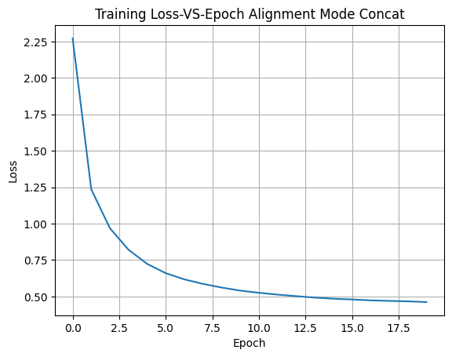
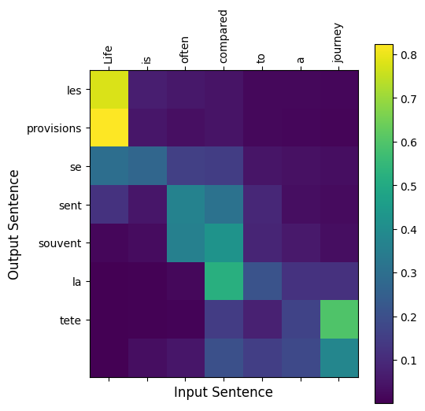
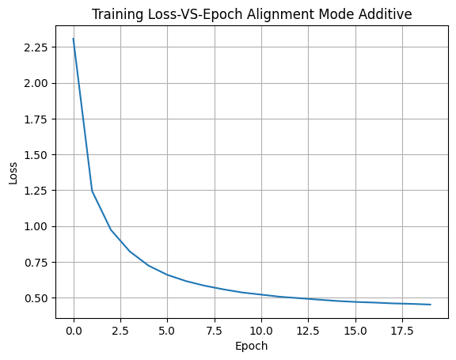
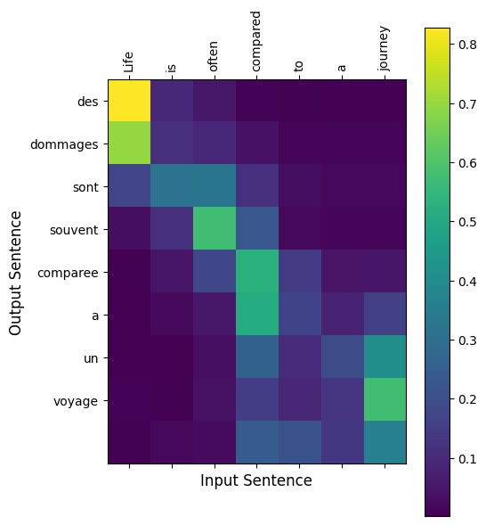

# Seq2Seq Neural Machine Translation with Bahdanau Attention (English → French)

This repository implements a neural machine translation (NMT) system using a **Seq2Seq architecture** enhanced by
**Bahdanau-style attention**. Unlike Luong attention, Bahdanau computes the attention context **before** the decoder
RNN, allowing it to dynamically focus on relevant parts of the input sequence.


We explore and compare the following attention variants described by **Luong et al. (2015)**:
- **Additive**
- **Concat**

---

## Project Overview

- Implements classic encoder-decoder architecture with Bahdanau attention  
- Uses teacher forcing during training  
- Handles variable-length sequences with padding and packing  
- Supports gradient clipping for stable training  
- Provides scripts and notebook for training and inference demonstrations  

---

## Dataset and Preprocessing

- Based on the [Tatoeba English-French dataset](https://www.manythings.org/anki/)  
- Filtered sentence pairs to max length of 10 tokens  
- Vocabulary sizes after preprocessing:  
  - English: 13,868 unique tokens  
  - French: 22,385 unique tokens  

---

## Attention Mechanisms

| Mode         | Description                                                                                                                                                                      |
| ------------ | -------------------------------------------------------------------------------------------------------------------------------------------------------------------------------- |
| **Concat**   | Concatenates encoder and decoder hidden states, passes through a feed-forward layer with tanh, then scores alignment. Effective and yielded reasonable translations in training. |
| **Additive** | Computes separate linear transforms of encoder and decoder states, adds them, applies tanh, then scores. Slightly different parameterization, also produces good translations.   |


---

##  Project Structure

```bash

seq2seq-nmt-luong-attention/
    ├── models.py                       # Encoder and decoder with Bahdanau attention
    ├── dataloader_generator.py         # Data loading and preprocessing
    ├── utils.py                        # Training, translation, visualization utilities
    ├── demo_script.py                  # Script to run training and inference
    ├── demo.ipynb                      # Training analysis notebook with examples
    ├── README.md                       # Project summary and insights
```
---

## Getting Started

### Requirements

```bash
 Install dependencies with:

    pip install -r requirements.txt
    
```
 ### Running the Demo:
 ```bash
     python demo_script.py
     jupyter notebook demo.ipynb
     
```
---


## Training Performance By Attention Types


### Concat Attention Training Logs

| Epoch | Loss   | Encoder Grad Norm | Decoder Grad Norm | Time (min) |
| ----- | ------ | ----------------- | ----------------- | ---------- |
| 0     | 2.2715 | 0.662             | 0.922             | 3.21       |
| 5     | 0.6596 | 0.746             | 0.940             | 16.13      |
| 10    | 0.5251 | 0.743             | 1.020             | 16.57      |
| 15    | 0.4793 | 0.680             | 0.917             | 16.93      |
| 19    | 0.4617 | 1.041             | 0.903             | 13.50      |


---


---


### Additive Attention Training Logs

| Epoch | Loss   | Encoder Grad Norm | Decoder Grad Norm | Time (min) |
| ----- | ------ | ----------------- | ----------------- | ---------- |
| 0     | 2.3076 | 0.573             | 0.883             | 3.47       |
| 5     | 0.6593 | 0.689             | 0.916             | 17.15      |
| 10    | 0.5209 | 0.749             | 0.964             | 17.08      |
| 15    | 0.4701 | 0.698             | 0.922             | 17.50      |
| 19    | 0.4516 | 0.948             | 1.061             | 13.60      |


Training converges steadily, with loss decreasing significantly after the first 10 epochs.

---


---

## Sample Translations

### Concat Attention


| Input Sentence                             | Target Translation                            | Model Prediction                              |
| ------------------------------------------ | --------------------------------------------- | --------------------------------------------- |
| i didn t want to stop                      | je ne voulais pas m arreter                   | je ne voulais pas m arreter                   |
| tom is an astronaut                        | tom est un spationaute                        | tom est un spationaute                        |
| do you have any knowledge of this matter ? | savez vous quelque chose a ce propos ?        | as tu du savoir cette affaire ?               |
| he bought her a dog                        | il lui a achete un chien                      | il lui a achete un chien                      |
| it isn t too late to turn back             | il n est pas trop tard pour rebrousser chemin | il n est pas trop tard pour rebrousser chemin |
| you re over analyzing                      | tu analyses trop                              | tu analyses trop                              |
| i m offering you a choice                  | je vous offre un choix                        | je t offre un choix                           |
| don t ever make me wait again              | ne me fais plus jamais attendre !             | ne me fais plus jamais attendre !             |
| we have no more information                | nous ne disposons pas davantage d information | nous n avons plus d informations              |
| we didn t wait that long                   | nous n avons pas attendu si longtemps         | nous n avons pas attendu si longtemps         |


### Additive Attention


| Input Sentence                                    | Target Translation                                                | Model Prediction                                     |
| ------------------------------------------------- | ----------------------------------------------------------------- | ---------------------------------------------------- |
| you should be careful not to become overconfident | tu devrais faire attention de ne pas devenir trop sur de toi meme | tu devrais faire attention a ne pas ton pantalon     |
| how long are you planning to stay ?               | combien de temps comptes tu rester ?                              | combien de temps comptes tu rester ?                 |
| your hair s beautiful                             | tes cheveux sont beaux                                            | vos cheveux sont beaux                               |
| i didn t know what to say                         | je ne savais pas quoi dire                                        | je ne savais pas quoi dire                           |
| why are you following me ?                        | pourquoi me suivez vous ?                                         | pourquoi me suivez vous ?                            |
| why do you want me to wait in here ?              | pourquoi voulez vous que j attende la dedans ?                    | pourquoi voulez vous que je vous attends ici ?       |
| that was never our intention                      | ce ne fut jamais notre intention                                  | cela ne fut jamais notre intention                   |
| we sent out the invitations yesterday             | nous avons envoye les invitations hier                            | nous avons envoye les invitations hier               |
| i ve thought a lot about it                       | j y ai consacre beaucoup de reflexion                             | j y ai beaucoup pense                                |
| do you think we should abandon ship ?             | pensez vous que nous dussions abandonner le navire ?              | pensez vous que nous devrions abandonner le navire ? |


---


## Conclusion

In this project, we implemented and trained neural machine translation models using Bahdanau’s attention mechanism with
two alignment modes: **Concat** and **Additive**. Both modes effectively improved translation quality by enabling the decoder
to dynamically focus on relevant parts of the input sequence.

- **Concat Mode** combines encoder and decoder hidden states explicitly before scoring, which helps the model capture richer
  interactions between source and target sequences. This resulted in fluent and contextually accurate translations.

- **Additive Mode** uses a learned feed-forward network to combine encoder and decoder states, showing strong performance
  in handling varied sentence structures and nuances.

The training metrics, gradient norms, and sample translations demonstrate that attention mechanisms are crucial for improving
sequence-to-sequence models, enabling better alignment and more precise predictions.

Overall, attention mechanisms significantly enhance the model’s translation capabilities compared to vanilla seq2seq architectures.
Future directions could involve experimenting with more sophisticated attention variants, incorporating transformer models,
or training on larger and more diverse datasets to further improve translation quality.

---
